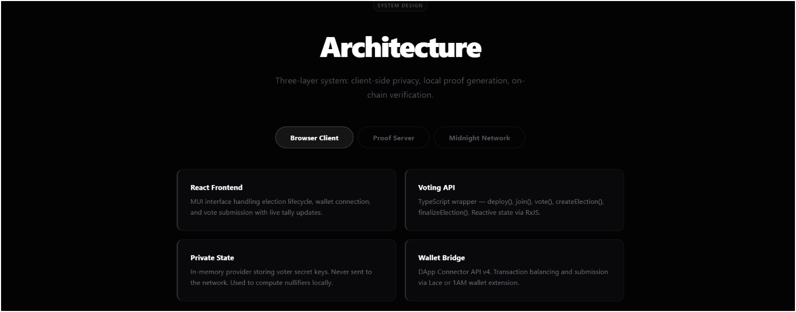
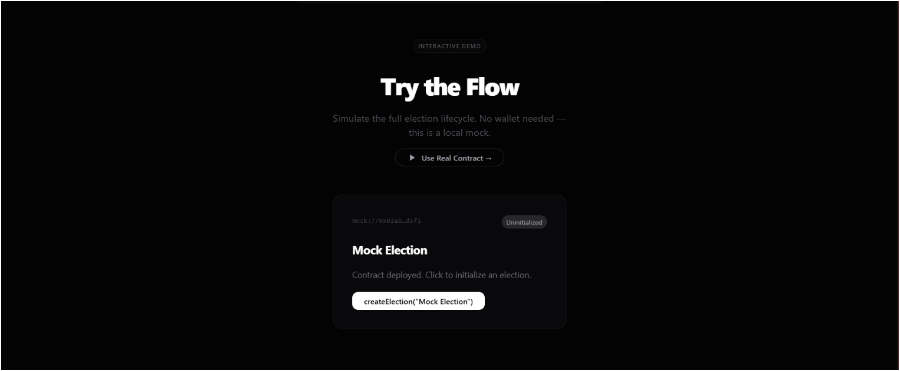
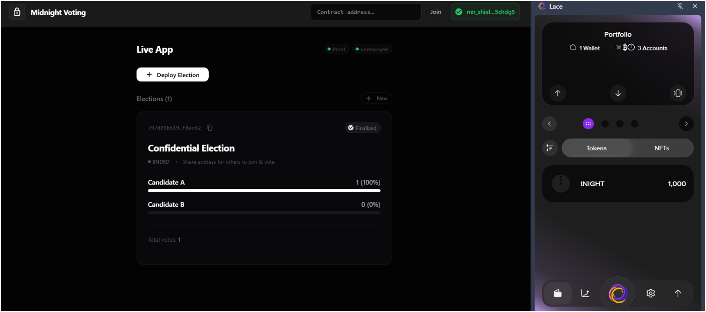

# Midnight Confidential Voting — Rise in Level 1 Challenge

Privacy-preserving voting DApp on the Midnight Network. Individual voter ballots are proven off-chain via Compact ZK circuits — tallies are publicly verifiable on-chain.

## Links

| Resource | URL |
|----------|-----|
| **Live Demo** | [https://midnight-inky-seven.vercel.app](https://midnight-inky-seven.vercel.app) |
| **Demo Video** | [Google Drive](https://drive.google.com/file/d/1Sy_zU8ESOT0saMXSukYuzGUrdcdXZ_-z/view?usp=sharing) |
| **Contract Address** | `ff4960ad66c533fc03ae116d182f2ca9782f149fa3d025eaeaffe23594c30942` |
| **Preprod Faucet** | [https://midnight-tmnight-preprod.nethermind.dev/](https://midnight-tmnight-preprod.nethermind.dev/) |
| **Midnight Docs** | [https://docs.midnight.network](https://docs.midnight.network) |

## Screenshots

### Landing Page


### Features


### Architecture


### Interactive Demo


### Live App (Wallet Connected + Finalized Election)


## Privacy Claim

**Individual votes are private.** Each voter's ballot is proven off-chain via a ZK proof generated locally. The proof demonstrates that the voter made a valid selection (candidate 0 or 1) without revealing which candidate was chosen. Only aggregate tally counters are public on-chain — individual vote choices never appear on the ledger.

The privacy mechanisms:
- `voterSecretKey()` witness — secret key never leaves the client
- `voterPublicKey()` — DApp-specific identity via `persistentHash`, unlinkable across elections
- `computeNullifier()` — prevents double-voting without linking to voter identity
- Vote choice proven valid in-circuit without revealing the mapping
- `Winner` enum — results published on-chain transparently after finalization

## Smart Contract

Written in Midnight's Compact language (`contract/src/confidential-voting.compact`):

| Circuit | Description | Privacy |
|---------|-------------|---------|
| `createElection(title, duration)` | Initialize election with deadline | Owner ZK identity |
| `vote(candidateIndex)` | Cast vote with nullifier | Choice proven valid without revealing it |
| `finalizeElection()` | Anyone can finalize after deadline | Decentralized — no owner needed |
| `ownerFinalizeElection()` | Emergency override | Owner ZK proof required |

**Ledger state:**
- `state`: Enum (UNINITIALIZED, OPEN, FINALIZED)
- `electionTitle`: Maybe<string>
- `candidate0Tally`, `candidate1Tally`, `totalVotes`: Counters
- `deadline`: Uint<64> (block time)
- `winner`: Enum (NONE, CANDIDATE_A, CANDIDATE_B, TIE)
- `nullifierSet`: Set<Bytes<32>> (double-vote prevention)
- `owner`: Bytes<32> (ZK identity)

Compiled with Compact compiler v0.31.1, runtime v0.16.0.

## Project Structure

```
midnight/demo/
├── contract/                         # Compact smart contract
│   └── src/confidential-voting.compact
├── api/                              # TypeScript API layer (VotingAPI class)
├── confidential-voting-cli/          # CLI for contract deployment
├── confidential-voting-ui/           # React frontend
│   ├── src/pages/                    # Landing, Features, Architecture, Demo, App
│   ├── src/components/               # Navbar, VotingCard, ParticleField, WalletSelect
│   ├── src/contexts/                 # Wallet + Voting deployment managers
│   ├── public/keys/                  # ZK prover/verifier keys
│   └── public/zkir/                  # Compiled ZK intermediate representation
├── docs/screenshots/                 # App screenshots
└── .github/workflows/ci.yaml        # CI pipeline
```

## Requirements Met (Level 1)

- ✅ **Wallet connect/disconnect** — Lace + 1AM with selection dialog (DApp Connector API v4)
- ✅ **Circuit called from frontend** — `createElection`, `vote`, `finalizeElection`, `ownerFinalizeElection`
- ✅ **Observable privacy behavior** — vote choice proven without being shown (ZK nullifier)
- ✅ **Contract deployed with verifiable address** — `ff4960ad...c30942`
- ✅ **8+ meaningful commits** — see git log

## Quick Start

### Prerequisites
- Docker Desktop
- Node.js 22+
- Lace or 1AM wallet extension (Chrome)

### Local Development

```bash
# 1. Start local Midnight network (node + indexer + proof server)
git clone https://github.com/midnightntwrk/midnight-local-dev.git
cd midnight-local-dev && npm install && npm start
# Fund your wallet via the interactive menu

# 2. Run the UI
cd confidential-voting-ui
npm install
npx vite --mode devnet

# 3. Set Lace to "Undeployed" network, open http://localhost:5173
```

### Preprod Network

```bash
# 1. Start proof server
docker run -d -p 6300:6300 midnightntwrk/proof-server:8.0.3 midnight-proof-server --network preprod

# 2. Configure Lace for Preprod, get tNIGHT from faucet, generate DUST

# 3. Run the UI
cd confidential-voting-ui
npm run dev
```

## Tech Stack

- **Contract:** Compact 0.23 (Midnight's ZK DSL)
- **Frontend:** React 19, MUI 9, Three.js, GSAP, Lenis, Framer Motion
- **Blockchain:** Midnight.js SDK 4.1.1, DApp Connector API v4
- **Proving:** midnightntwrk/proof-server:8.0.3
- **Deploy:** Vercel

## License

MIT
