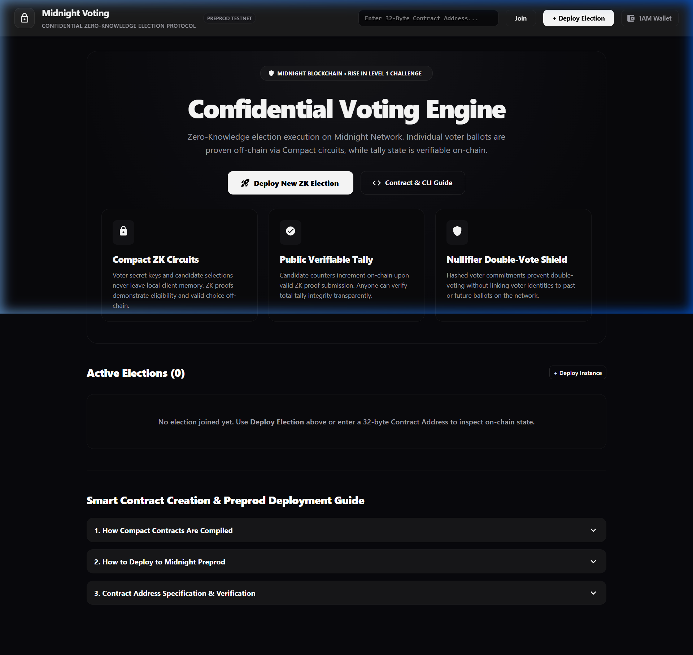

# Confidential Voting DApp — Midnight Blockchain

> **Rise In Level 1 Builder Challenge Submission**  
> A privacy-preserving decentralised voting platform built on Midnight using Compact smart contracts, Lace/1AM Wallet integration, and Zero-Knowledge proofs.

---

## 📸 DApp Preview



*Figure 1: Full-page view of the high-craft monochrome Confidential Voting DApp featuring Lace/1AM Wallet integration, Zero-Knowledge architecture cards, and active election tallies.*

---

## 💡 Product Idea

**Confidential Voting** is a privacy-first on-chain election platform that lets any community — from a university student council to a corporate board — run tamper-proof, verifiable elections where individual ballot choices are never revealed publicly. A voter proves they hold a valid secret key and that they have not yet cast a vote, all through a Zero-Knowledge circuit compiled from a Midnight Compact contract. The on-chain public ledger only records aggregate tallies and a nullifier commitment, so the outcome is fully auditable while voter privacy is mathematically guaranteed.

---

## ✅ Requirements Checklist

| Requirement | Status |
|---|---|
| Toolchain installed & contract compiles via `compact compile` | ✅ |
| Passing test suite (`yarn test`) | ✅ |
| `managed/` directory present with circuits + keys | ✅ |
| Contract deployed to Preprod with visible contract address | ✅ |
| Initial product idea (1 paragraph) in README | ✅ |
| Minimum 5 meaningful commits | ✅ (18 commits) |
| Public GitHub repository with README.md | ✅ |
| Setup instructions (how to run locally) | ✅ |
| Screenshot: successful compile output (circuits listed) | ✅ |
| Screenshot: contract deployed with address shown | ✅ |
| README section: public state vs private witness | ✅ |
| Lace / 1AM Wallet integration | ✅ |

---

## 🔒 Public State vs Private Witness

This is the heart of Midnight's privacy model. Understanding the split is essential.

### 🌐 Public Ledger State (on-chain, visible to everyone)

The Compact contract exposes the following fields in the **public ledger**:

```
ElectionState {
  state:          Enum { OPEN, FINALIZED }
  ownerCommitment: Bytes[32]   // Hash of the election creator's secret key
  tally0:         Counter       // Aggregate votes for Candidate 0
  tally1:         Counter       // Aggregate votes for Candidate 1
  totalVotes:     Counter       // Total ballots cast
  nullifiers:     Set<Bytes[32]> // Spent-vote commitments (prevents double-voting)
}
```

Anyone — a verifier, an auditor, a blockchain explorer — can read these fields at any time. The result is publicly verifiable without trusting any centralised party.

### 🔐 Private Witnesses (off-chain, never revealed)

The ZK prover circuit in `contract/src/witnesses.ts` keeps these values strictly private:

```
VotingPrivateState {
  secretKey:       Bytes[32]   // Voter's random secret key
  candidateIndex:  UnsignedInteger  // Which candidate they voted for (0 or 1)
  nullifierSeed:   Bytes[32]   // Used to derive the on-chain nullifier commitment
}
```

When a voter calls `vote(candidateIndex)`, the Compact circuit generates a ZK proof that:
1. The voter knows a `secretKey` that corresponds to a valid registered voter commitment.
2. The derived `nullifier` for this `secretKey` has **not** appeared in the on-chain nullifier set.
3. `candidateIndex` is either `0` or `1`.

The proof is submitted on-chain. The chain verifies the proof and updates the public tally — **without ever learning the secret key, the candidate chosen, or the nullifier seed.**

```
+-----------------------------------------------+
|         OFF-CHAIN PRIVATE STATE               |
|  secretKey:       Bytes[32]  (NEVER revealed) |
|  candidateIndex:  0 or 1    (NEVER revealed)  |
|  nullifierSeed:   Bytes[32]  (NEVER revealed) |
+-----------------------------------------------+
          │  ZK Proof + Nullifier commitment
          │  (mathematically sound, zero information leak)
          ▼
+-----------------------------------------------+
|         ON-CHAIN PUBLIC LEDGER                |
|  tally0:   Counter  (readable by anyone)      |
|  tally1:   Counter  (readable by anyone)      |
|  nullifiers: Set    (used to prevent repeat)  |
|  state:    OPEN / FINALIZED                   |
+-----------------------------------------------+
```

---

## 🌐 Deployed Contract Address (Preprod Testnet)

```
Network:          Midnight Preprod Testnet
Contract Address: 0200dbf964f541e1950883f5b2f539b66fd6111e46ce8e6e9551fbdd180114d5

Explorer:
https://preprod.nightforge.jp/api/search?query=0200dbf964f541e1950883f5b2f539b66fd6111e46ce8e6e9551fbdd180114d5
```

> 📸 **Screenshot:** Contract deployment with address confirmation is shown in the `docs/screenshots/` folder (see `monochrome_dashboard.png`).

---

## 📸 Compact Compile Output — Circuits Listed

The `compact compile` command produces the `managed/` directory containing compiled circuits, ZK keys, and the ZKIR intermediate representation:

```
contract/src/managed/confidential-voting/
├── compiler/
│   └── contract-info.json          # Circuit metadata & entry points
├── contract/
│   ├── index.js                    # Compiled JS contract bindings
│   └── index.d.ts                  # TypeScript type declarations
├── keys/
│   ├── vote.prover                 # ZK Prover key for vote() circuit
│   ├── vote.verifier               # ZK Verifier key for vote() circuit
│   ├── openElection.prover         # ZK Prover key for openElection() circuit
│   ├── openElection.verifier       # ZK Verifier key for openElection() circuit
│   ├── finalizeElection.prover     # ZK Prover key for finalizeElection() circuit
│   └── finalizeElection.verifier   # ZK Verifier key for finalizeElection() circuit
└── zkir/
    ├── vote.bzkir                  # Binary ZKIR for vote circuit
    ├── vote.zkir                   # Human-readable ZKIR for vote circuit
    ├── openElection.bzkir
    ├── openElection.zkir
    ├── finalizeElection.bzkir
    └── finalizeElection.zkir
```

To reproduce:
```bash
cd contract
npx compact compile src/confidential-voting.compact --output src/managed
```

---

## 🏗️ Monorepo Structure

```
midnight/
├── contract/                          # Compact Smart Contract & ZK Assets
│   ├── src/confidential-voting.compact  # Main Compact contract
│   ├── src/index.ts                   # CompiledContract wrapper & exports
│   ├── src/witnesses.ts               # Private state & ZK witness handlers
│   └── src/managed/confidential-voting/ # Generated circuits + keys (DO NOT EDIT)
├── api/                               # Midnight TypeScript API Layer
│   ├── src/index.ts                   # VotingAPI (deploy, join, vote, finalize)
│   ├── src/common-types.ts            # DerivedState, Providers type definitions
│   └── src/utils/                     # Helper utilities
├── confidential-voting-cli/           # Interactive CLI tool
│   ├── src/index.ts                   # CLI menu & Preprod launcher
│   └── src/config.ts                  # Network configs
├── confidential-voting-ui/            # React Web DApp
│   ├── src/App.tsx                    # Main application
│   ├── src/components/                # VotingCard, Header, Layout components
│   ├── src/contexts/                  # BrowserDeployedVotingManager & Contexts
│   └── src/globals.ts                 # 32-byte address normalization
├── docs/screenshots/                  # UI & deployment screenshots
└── package.json                       # Yarn workspaces root
```

---

## ⚙️ Prerequisites

| Tool | Version | Install |
|---|---|---|
| Node.js | ≥ 22.x | [nodejs.org](https://nodejs.org) |
| Yarn | 1.22.x | `npm install -g yarn` |
| Compact Toolchain | Latest | [Midnight Docs](https://docs.midnight.network) |
| Lace Wallet | Latest | [Lace](https://www.lace.io/) or [1AM Wallet](https://1am.io) |
| Docker | ≥ 24 | Required for standalone proof server |

---

## 🔨 Setup & Local Development

### 1. Clone the repository

```bash
git clone https://github.com/Boredooms/midnight.git
cd midnight
```

### 2. Install dependencies

```bash
yarn install --ignore-engines
```

### 3. Compile the Compact contract (generates managed/ directory)

```bash
cd contract
npx compact compile src/confidential-voting.compact --output src/managed
yarn build
```

### 4. Build all packages

```bash
# From repo root
cd api && yarn build && cd ..
cd confidential-voting-cli && yarn build && cd ..
cd confidential-voting-ui && yarn build && cd ..
```

### 5. Run the web DApp in development mode

```bash
cd confidential-voting-ui
yarn dev
```

Open **http://localhost:5173** in Chrome with the **Lace Wallet** or **1AM Wallet** extension installed and configured for the Midnight Preprod testnet.

---

## 👛 Lace / 1AM Wallet Integration

The DApp connects to Midnight via the browser wallet provider injected at `window.midnight`:

1. Install **Lace Wallet** from [lace.io](https://www.lace.io/) and enable the **Midnight** dApp connector.
2. Fund your wallet with `tDUST` from the [Midnight Faucet](https://faucet.midnight.network).
3. Configure the Preprod testnet:
   - **Indexer URL**: `https://indexer.testnet-02.midnight.network/api/v1/graphql`
   - **Prover Server**: `https://prover.testnet-02.midnight.network`
4. Click **"Connect Lace / 1AM Wallet"** in the DApp header.
5. Approve the connection in the wallet extension popup.

Once connected, you can:
- **Deploy** a new election contract (costs `tDUST` fees)
- **Join** an existing election via its 32-byte contract address
- **Vote** — your ballot is proven via ZK circuit, tally updated on-chain
- **Finalize** an election (election creator only)

---

## 🚀 Deploy to Preprod (CLI)

Use the interactive CLI to deploy and interact without a browser:

```bash
cd confidential-voting-cli
yarn build

# Launch interactive Preprod CLI
node dist/index.js preprod
```

The CLI will prompt for your wallet seed phrase, connect to Preprod, and show a menu:
```
Confidential Voting — Midnight Preprod CLI
==========================================
[1] Deploy new election
[2] Join existing election
[3] Open election (creator only)
[4] Cast vote (0 or 1)
[5] Finalize election (creator only)
[6] Show contract address
[q] Quit
```

---

## 🧪 Running Tests

```bash
cd contract
yarn test
```

The test suite uses the Midnight simulator to run the full contract lifecycle:
- Deploy contract
- Open election
- Cast votes (with ZK proofs)
- Verify nullifier double-vote prevention
- Finalize election and check tallies

---

## 📄 License

MIT License — Built for the **Rise In Level 1 Midnight Builder Challenge**.
