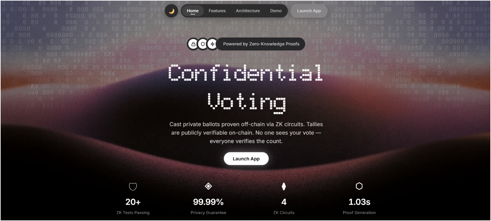
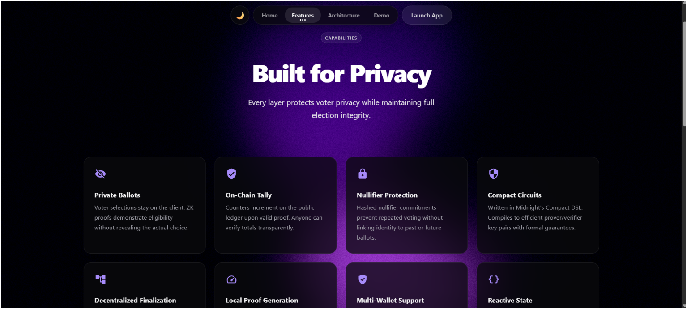
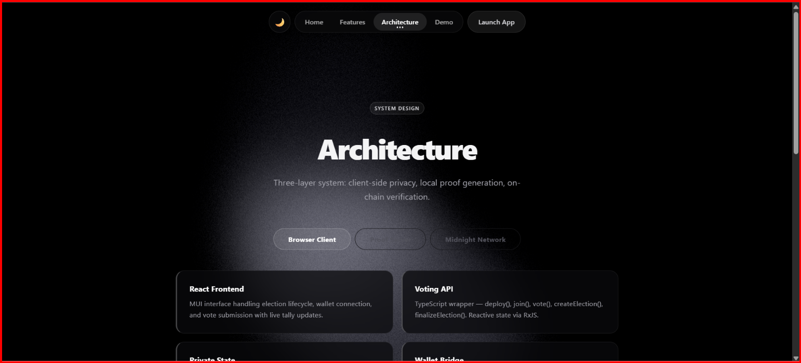
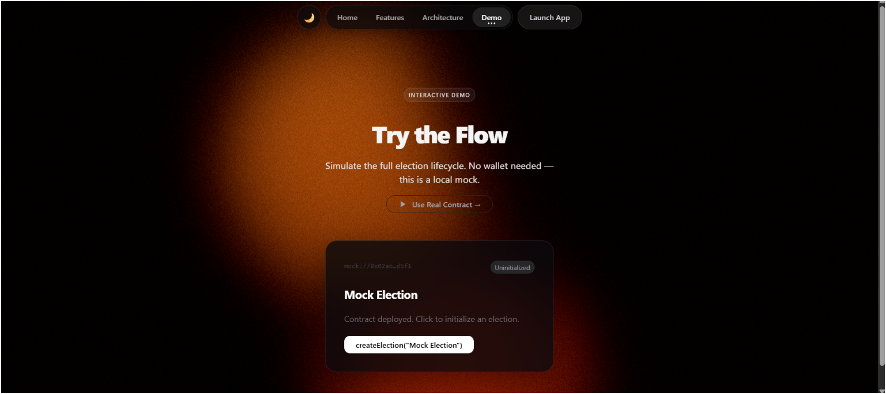
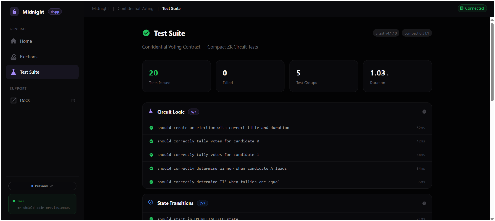
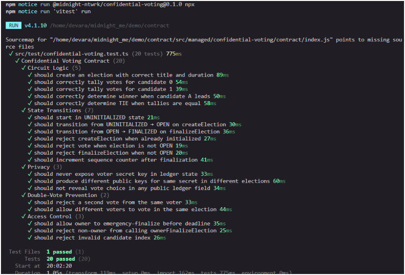

# Midnight Confidential Voting


> Privacy-preserving decentralized voting on the Midnight Network — anonymous ballots, publicly verifiable tallies.

## Live Demo

[https://midnight-inky-seven.vercel.app](https://midnight-inky-seven.vercel.app)

## Screenshots

| Page | Preview |
|------|---------|
| Landing |  |
| Features |  |
| Architecture |  |
| Demo |  |
| Main dApp |  |
| Test Suite |  |
| Tests Passing |  |

## Contract Address

| Network | Address |
|---------|---------|
| Preview | [`79bda166f07754080384f07744c742033cabff15f3ba428433e25d413cf2bb8b`](https://preview.midnightexplorer.com/contracts/0x79bda166f07754080384f07744c742033cabff15f3ba428433e25d413cf2bb8b) |

## What This Does

A confidential voting DApp where:
- An election owner deploys a ballot with a title and deadline
- Voters cast private ballots — their choice (candidate 0 or 1) is proven valid in a ZK circuit without ever being revealed
- Nullifiers prevent double-voting without linking to voter identity
- Anyone can finalize the election after the deadline (decentralized — no owner needed)
- Final tallies and winner are published on-chain transparently

## Privacy Model

- **PUBLIC:** Election title, deadline, total votes, per-candidate tallies, winner, election state, DApp-specific public keys, vote nullifiers
- **PRIVATE:** Voter's secret key, voter's actual choice, voter's real identity
- **PROVED without revealing:** Vote validity (choice is 0 or 1), voter uniqueness (hasn't voted before), owner identity (for emergency finalize)

## Privacy Claim

**What an on-chain observer sees:**
- Aggregate tallies increment (candidate0Tally: 5, candidate1Tally: 3)
- A nullifier was added to the set (proves someone voted, but unlinkable to identity)
- The election was finalized with a winner

**What an on-chain observer CANNOT see:**
- Which candidate any specific voter chose
- Who cast any specific vote (nullifiers are derived from secret key + sequence — no address linkage)
- The voter's secret key (never leaves their local machine)
- Any connection between a voter's identity across different elections (public keys are election-specific via `persistentHash`)

## Tech Stack

| Layer | Technology |
|-------|-----------|
| Smart Contract | Compact 0.23 (Midnight's ZK DSL) |
| Frontend | React 19, MUI 9, Framer Motion, Three.js, GSAP |
| Blockchain SDK | Midnight.js 4.1.1, DApp Connector API v4 |
| Proof Server | `midnightntwrk/proof-server:8.1.0` (Docker) |
| Testing | Vitest 4.x, compact-runtime simulator |
| CI/CD | GitHub Actions |
| Deploy | Vercel |

## Prerequisites

- Node.js v22+
- Docker Desktop (for the proof server)
- Lace or 1AM wallet extension (Chrome)

## Setup & Run Locally

```bash
# Clone the repo
git clone https://github.com/Boredooms/midnight.git
cd midnight

# Install dependencies
npm install --legacy-peer-deps

# Start the proof server (required for all networks)
cd confidential-voting-ui
docker compose up -d
# Verify: curl http://localhost:6300/version → "8.1.0"

# Run the frontend (preview network)
npm run dev:preview
# Opens at http://localhost:5173

# Or for local dev (requires midnight-local-dev running):
npm run dev:local
```

### Wallet Setup (Preview Network)

1. Install [Lace wallet](https://www.lace.io/) extension
2. Switch to **Preview** network in Lace settings
3. Fund wallet from [Preview faucet](https://midnight-tmnight-preview.nethermind.dev/)
4. Register for DUST generation
5. Connect wallet in the DApp and interact with the election

## Run Tests

```bash
cd contract
npx vitest run
```

**20 tests** covering:
- Circuit logic (createElection, vote, finalize correctness)
- State transitions (UNINITIALIZED → OPEN → FINALIZED)
- Privacy (secret key never leaks, nullifiers unlinkable)
- Double-vote prevention
- Access control (owner-only emergency finalize)

## CI/CD

The GitHub Actions pipeline (`.github/workflows/ci.yaml`) runs on every push to `main` and on pull requests:

1. **Contract job:** Compile Compact → typecheck → lint → build → run 20 unit tests
2. **API job:** Build the TypeScript API layer
3. **UI job:** Typecheck + production build of the React frontend
4. **CLI job:** Build the deployment CLI

All jobs run in parallel where possible (API, UI, CLI depend on contract artifacts).

## Project Structure

```
├── contract/                         # Compact smart contract
│   ├── src/confidential-voting.compact
│   └── src/test/confidential-voting.test.ts  ← 20 tests
├── api/                              # TypeScript API (VotingAPI class)
├── confidential-voting-cli/          # CLI for deployment
├── confidential-voting-ui/           # React frontend
│   ├── src/config/networks.ts        # Multi-network config
│   ├── src/contexts/                 # Wallet + Voting + Network contexts
│   ├── src/components/NetworkSwitcher.tsx
│   ├── docker-compose.yml            # Proof server
│   └── public/keys/ & zkir/          # ZK proving artifacts
├── .github/workflows/ci.yaml         # CI/CD pipeline
├── PROPOSAL.md                       # Product proposal
└── README.md
```

## Product Proposal

See [PROPOSAL.md](./PROPOSAL.md)

## License

MIT
